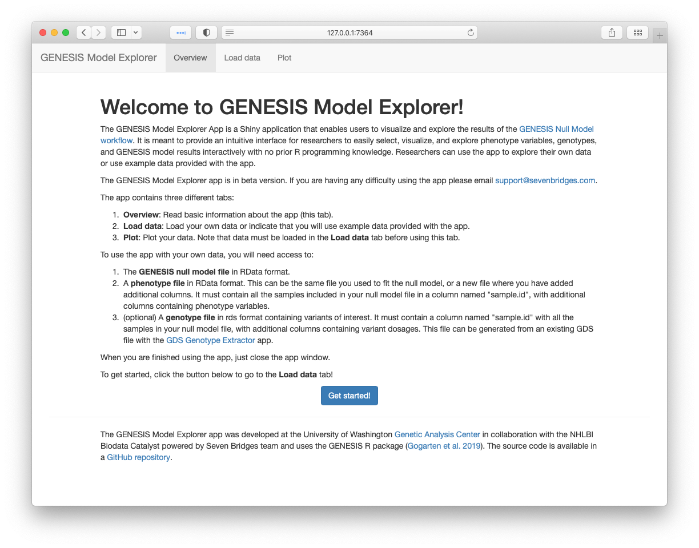
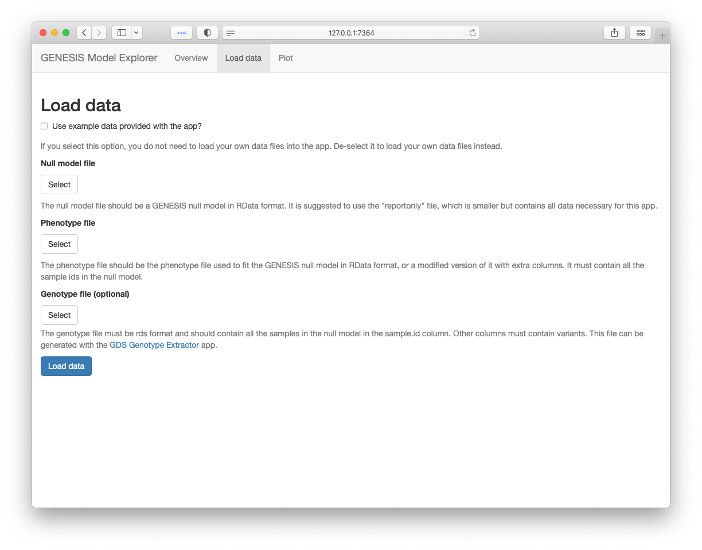
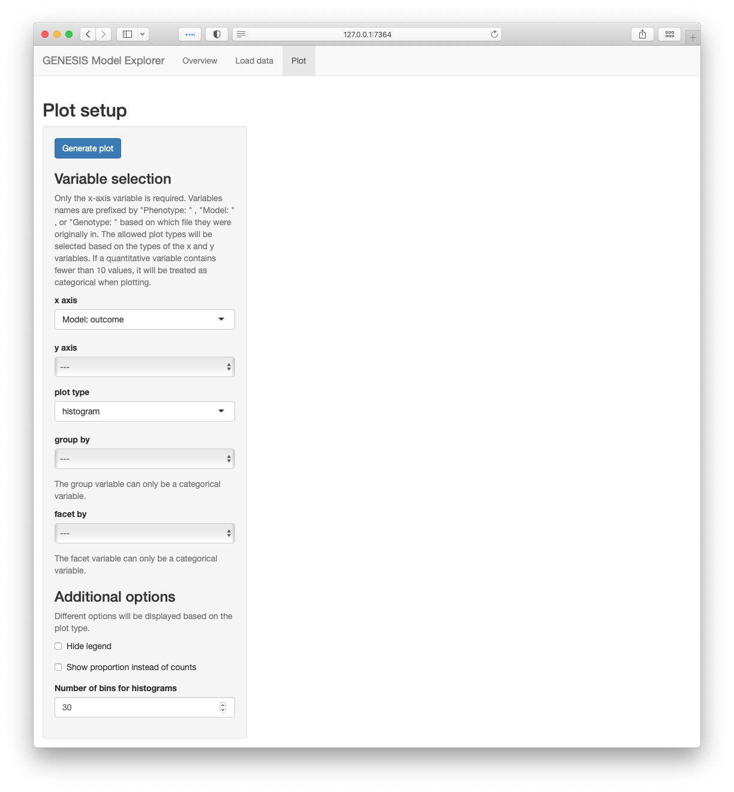
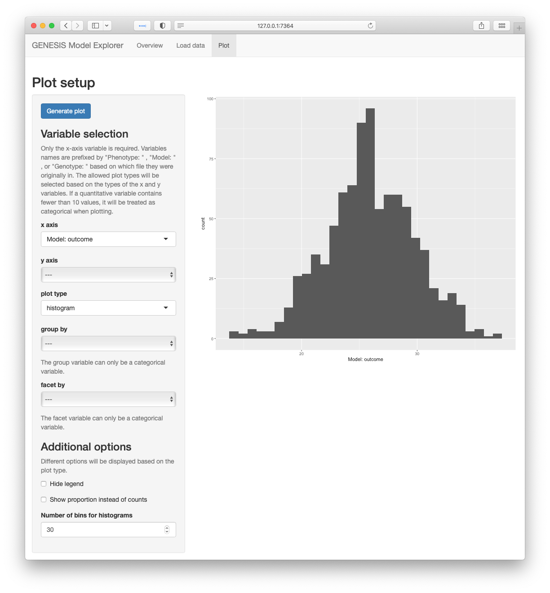
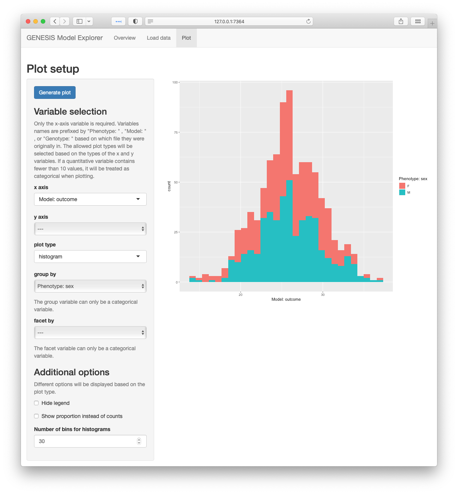

<!-- README.md is generated from README.Rmd. Please edit that file -->

# GENESIS Model Explorer App

<!-- badges: start -->

[](https://lifecycle.r-lib.org/articles/stages.html#experimental)
[](https://github.com/UW-GAC/shinyNullModel/actions)
<!-- badges: end -->

The GENESIS Model Explorer App is a Shiny application developed by the
Genetic Analysis Center at the University of Washington in collaboration
with Seven Bridges Genomics. It enables users to visualize and explore
the results of the [GENESIS Null Model
workflow](https://platform.sb.biodatacatalyst.nhlbi.nih.gov/public/apps/admin/sbg-public-data/null-model).

It is meant to provide an intuitive interface for researchers to easily
select, visualize, and explore phenotype variables, genotypes, and
GENESIS model results interactively with no prior R programming
knowledge.

Researchers can use the app to explore their own data or use example
data provided with the app.

If comparisons with genotypes are desired, users can use the [GDS
Genotype
Extractor](https://platform.sb.biodatacatalyst.nhlbi.nih.gov/public/apps/smgogarten/uw-gac-commit/gds-genotype-extractor)
tool, which enables researchers to export genotype dosages for a small
number of variants from a GDS file into the format required by this app.

## Installation

You can install the development version from
[GitHub](https://github.com/) with:

``` r
# install.packages("devtools")
devtools::install_github("UW-GAC/shinyNullModel")
```

## Launch GENESIS Model Explorer App

To launch the app, run the following:

``` r
shinyNullModel::run_app()
```

## App workflow

This app contains three tabs, which will be described in their own
sections below.

1.  Overview
2.  Load data
3.  Plot

### Overview tab

This page gives a brief overview of the app’s purpose and what files are
required to run the app.



### Load data tab

This tab allows you to select which data you would like to plot. You can
select either the example data provided by the app or provide your own
data.



To use the example data, click on the **Use example data?** checkbox.
The other file selections will disappear.

To use your own data, you will need to select both a **null model file**
and a **phenotype file**. They are required to be in RData format. Both
of these files are produced by the GENESIS Null Model app. You can
optionally modify the phenotype file to add additional columns to use
when plotting, as long as the modified version is stored in an Annotated
Data Frame and saved as an RData file.

You may optionally provide a **genotype file** to generate plots by the
genotype of selected variants. This file should be generated by the GDS
Genotype Extractor app.

Once you have selected your data, click the “Load Data” button at the
bottom of the page. This will load your data into the app and combine it
into a single data frame to use in plotting. The app will display a
progress bar while the data are being loaded. Once the data have been
loaded, the app will automatically load the next tab, Plot.

### Plot tab

This tab is where you will generate plots of your data in the GENESIS
Model Explorer app. You can generate:

  - Histogram, density, or bar plots of a single variable.
  - Hexbin, scatter, box, or violin plots of two variables.
  - Plots grouped (colored) by a categorical variable.
  - Plots faceted by a categorical variable.



To interact with this tab, you will select plot options in the panel on
the left side of the page. Once you are happy with your selections, you
will click on the **Generate plot** button at the top of the panel. The
plot will then be displayed on the right side of the page.

When selecting which variable to include in plots, variable names are
prefixed by the file where they originated in order to differentiate
between variables with the same name in different files. For example,
“Model: resid.marginal” indicates that the app will plot the
“resid.marginal” variable from the null model file, and “Phenotype:
bmi” indicates that the app will plot the variable named “bmi” in the
phenotype file.

To generate plots of a single variable, select a variable for the
**x-axis** from the dropdown menu and set the **y-axis** dropdown set to
“—”.

To generate plots of two variables, select a variable in both the
**x-axis** and **y-axis** dropdown menus.

After selecting variables, a default plot type is chosen automatically,
but you may change the type using the **plot type** dropdown menu. The
default and allowed types are chosen based on the data types of the
variable(s) that you have selected. For example, the “histogram” plot
type is only available when you have selected an x-axis variable and no
y-axis variable, while the “hexbin” plot type is only available when you
have selected quantitative variables for both the x-axis and y-axis.
Finally, you are not able to select categorical variables for both the
x-axis and the y-axis.

You may further customize your plot with the following:

  - The **group by** dropdown menu will select a variable to group your
    plot by. This displays different categories in different colors.
    Note that only categorical variables appear in this dropdown. If you
    have selected the “hexbin” plot type, the plot will not be grouped
    even if you have selected a variable to group by.
  - The **facet by** dropdown will select a variable to facet your plot
    by. This displays different categories as different panels. Note
    that only categorical variables appear in this dropdown.

Additional options are also available depending on the plot type you
have selected.

Once you have made your variable selections, click on the **Generate
plot** button at the top of the panel. The plot will appear to the right
of the panel. This shows an example histogram of the model outcome.



You may then make new variable selections in the panel on the left. To
update the plot with the new variable selections, click on the
**Generate plot** button again. This shows an example of plotting the
model outcome as a histogram, grouped by the “sex” variable in the
phenotype file.



## Closing the app

When you are done using the GENESIS Model Explorer App, just close the
app window.

## Code of Conduct

Please note that the shinyNullModel project is released with a
[Contributor Code of
Conduct](https://contributor-covenant.org/version/2/0/CODE_OF_CONDUCT.html).
By contributing to this project, you agree to abide by its terms.
